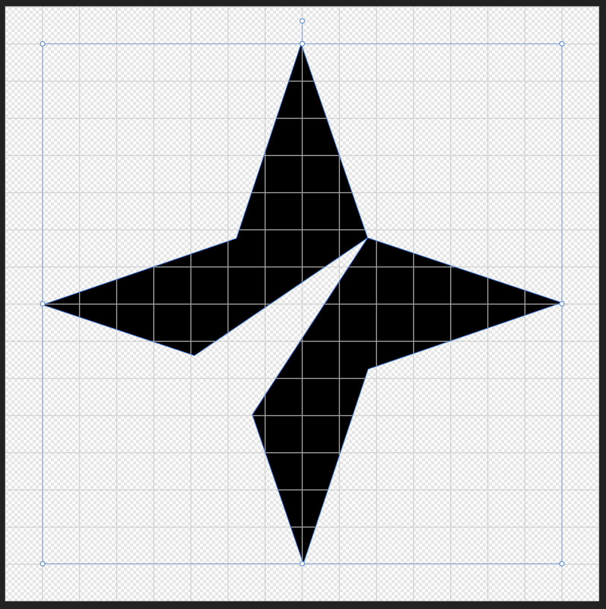

# Star Tribune Icons

Icons used in projects as different formats.

## Requirements

- Node 18 or higher
- Yarn 4

## Things to note

- Colors embedded in an icon do not display in the font version of the icon. This is expected behavior. To use the color
  version of an icon, you will need to use the sprite or embed the SVG info directly on the page.
- There are many icons in this font that are designated "color" icons and will not work as a normal font icon because
  the color coverage is near 100%. In these situations, you will need to use the Sprite or embed the SVG directly in
  your project.
    - These icons all have the suffix `-color` in the icon name. Examples: `sports-league-nhl-color` and
      `weather-day-sunny-lg-color`
- Self-hosted is required to be able to verify certain features on the site:
    - The "Download SVG" button on icon pages will only trigger a download when viewing the self-hosted site. Otherwise,
      it will just navigate you to the icon in the browser.
    - Sprite SVG displays will be blank, both on the icon page and the sprites page.

## Adding and managing icons

### Setting up the Application

* Open a terminal window and navigate to the application's root directory
    1. Make sure your computer supports NodeJS and run: `npm install`
    2. Run: `pwd` to output the full computer path of the application's root. Copy this value down
        * Example: `/Users/riggllm/GitHub/strib-icons`
* In your IDE, open the `config/local/` directory and create a file called `hugo.yml`.
    1. Add the following line to the file: `baseURL: "/_site"`
    2. Modify that line by pasting the output from `pwd` into the `baseURL` property, before the `/_site` value.
        * Example: `baseURL: "/Users/riggllm/GitHub/strib-icons/_site"`
        * This file is not tracked by GitHub.
* The old version of the application had a self-hosting option that is replicated in this version of the application.
  However, self-hosting is not required to be able to work with the repo locally. See "Scrips and Commands" below for
  more
  info about building and self-hosting.

### Icons

* Icons should be in SVG format.
    * Canvas/artboard dimensions are 16px x 16px.
    * SVG should be centered in the canvas, with a 1px gap on each of the widest sides
    *  
* Do not set a fill color on SVG paths unless the color is very important, such as with the Star Tribune logo.
    * When Icons are processed into the font, most properties are stripped off of the SVG to condense the information as
      much as possible. "fill" is **not** one of the properties that is stripped.
    * If you need to maintain a fill color on an icon, use a CSS variable with a default hex color. Example:
      ```
      fill="var(--company-logo-top, #65cc5c)"
      ```
      Doing this allows control over the icon colors while also providing an initial color.
    * Do NOT use "white" to create a hole in the icon. This should be avoided by eliminating overlaps between layers in
      your image editor.
        * Note: There are technically two icons that do this at this time: `social-youtube` and `social-spotify`. This
          is because the white is actually part of the color logo, and the "hole" in question is coincidentally
          necessary for the font version of the icon.
    * You may need to manually edit the SVG to do these things.
* Icon originals are stored in `icons/`. To add new icons, add them here.
    * The file name of the icon will become the class name of the icon in CSS, so be consistent and reasonable, use only
      lowercase and dashes, i.e. `category-name-modifier.svg`
    * The codepoint for new icons will automatically be generated at the end of the list.
    * You will also need to generate a documentation page for the

### Scripts and Commands

* Run: `npm run pages` to generate markdown files for any icons that were added.
* Run: `npm run icons` generate new font files and code points for new icons.
* Run: `npm run docs:build` to build a non-hosted version of the site for local development.
    * Non hosted site found at location you added to `/config/local/hugo.yml`.
    * Example: `/Users/riggllm/GitHub/strib-icons/_site/index.html`
* Run: `npm run start` to build and serve a hosted version of the site for local development
    * Hosted site is, by default, found at: `http://localhost:4000`.
    * Check the terminal output for a line that looks like:
      `Web Server is available at //localhost:4000/ (bind address 127.0.0.1)` if the `4000` port is not working
* Run: `npm run version:increment` to modify the version number of the production application.
    * You need to supply the "current" version number (example: `1.0`) and the "new" version number (example: `1.1`) to
      the command.
        * Example: `npm run version:increment 1.0 1.1`
    * The "new" version number will need to match the folder the production application lives in
* Run: `npm run release:build` to build the production code for deployment.
    * This rebuilds the icon and html files using the production base URL, rather than your local computer.

### Templates

Templates are managed in `docs/` and are used to output the CSS and HTML. The application uses Hugo to build and serve
the HTML pages for development. For information on templating with Hugo, go
to: https://gohugo.io/templates/introduction/

There are also two handlebar templates in `/build/font` and are used to generate the scss/css files for the font. For
information on handlebars, go to: https://handlebarsjs.com/

## Deployment

The production code lives in the `static.startribune.com` S3 bucket. Multiple versions of the font exist and are hosted
simultaneously in versioned folders. To deploy a new version of the icon font, do the following:

1. Increment the version number with the `version:increment` script. Make sure to provide the current and new versions
   to the command.
    * Example: Moving from version 1.0 to 1.1, run: `npm run version:increment 1.0 1.1`
2. Create a new folder in S3 to match the version number that was set in the previous step.
    * Icon versions are found in the `/static.startribune.com/assets/libs/strib-icons` folder
3. Build fresh versions of the font and web files
    * Run: `npm run release:build`
4. Copy everything from your  `/_site` folder into the folder you created on S3.

## License

All images, content are copyright material of Star Tribune and require permission for re-use. Other code or similar
assets fall under the `LICENSE.code` license.
